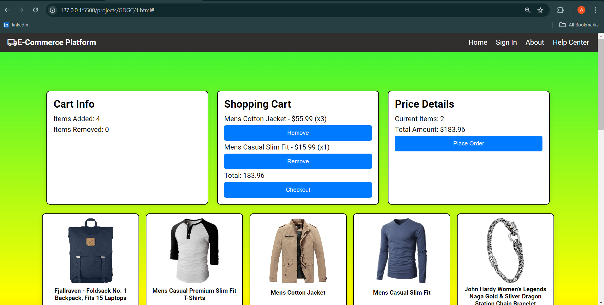

# GDGC_2024_WEB-DEVELOPMENT-ASSIGNMENT

# Store E-Commerce Application

## Table of Contents
- [Project Overview](#project-overview)
- [Features](#features)
- [Technologies Used](#technologies-used)
- [Installation](#installation)
- [Usage](#usage)
- [Execution Process](#execution-process)
- [Screenshots](#screenshots)
- [Video Demo](#video-demo)
- [GitHub Repository](#github-repository)

## Project Overview
This is a simple e-commerce application that allows users to browse products, add them to a shopping cart, and proceed to checkout. The application fetches product data from a fake store API and allows basic cart operations.

## Features
- View products with images and prices
- Add and remove products from the shopping cart
- Display cart summary with total amount
- Responsive design for mobile and desktop devices

## Technologies Used
- HTML
- CSS
- JavaScript
- Fetch API
- Git

## Installation
1. Clone the repository:
   ```bash
   git clone https://github.com/yourusername/fake-store.git
   ```
2. Navigate to the project directory:
   ```bash
   cd fake-store
   ```
3. Open `index.html` in a web browser to view the application.

## Usage
- Click on "Add to Cart" to add products to the cart.
- Click on "Remove from Cart" to remove products from the cart.
- The cart summary displays the number of items and the total amount.
- The layout is responsive, adjusting to different screen sizes.

## Execution Process
1. Clone the repository to your local machine.
2. Open the `index.html` file in a web browser.
3. Interact with the application by adding and removing products.
4. Take screenshots of the application in action and note the different states (e.g., empty cart, items added).
5. Record a video demo showcasing the features and functionality of the application. Use screen recording software to capture your screen while you navigate through the app.
6. Upload the video demo to a file-sharing service or directly to your GitHub repository (if size allows).
7. Push your code to a GitHub repository:
   ```bash
   git add .
   git commit -m "Initial commit"
   git push origin main
   ```

## Screenshots

*Product Listing*


*Shopping Cart*

## Video Demo
[Video Demo Link](your-video-link)

## GitHub Repository
[GitHub Repository Link](https://github.com/yourusername/fake-store)
